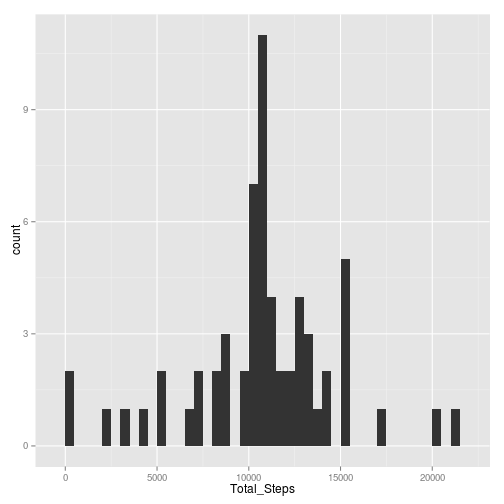
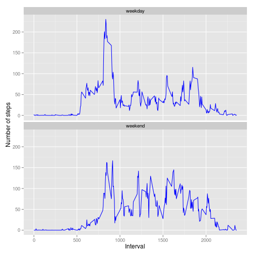

# Reproducible Research: Peer Assessment 1

This is a RMakeDown file for Reproducible Research Peer Assessment 1

## Loading and preprocessing the data


```r

data <- read.csv("activity.csv")
```


## What is mean total number of steps taken per day?

```r
library(plyr)
library(ggplot2)


final_data <- ddply(data, ~date, summarize, total_steps = sum(steps))

qplot(final_data$total_steps, binwidth = 500, xlab = "Total_Steps")
```

 

```r

mean_steps <- mean(final_data$total_steps[!is.na(final_data$total_steps)])

mean_steps
```

```
## [1] 10766
```

```r

median_steps <- median(final_data$total_steps[!is.na(final_data$total_steps)])

median_steps
```

```
## [1] 10765
```

## What is the average daily activity pattern?

```r
data_NONA <- data[complete.cases(data), ]
final_data1 <- ddply(data_NONA, ~interval, summarize, avg_steps = mean(steps))
plot(final_data1$interval, final_data1$avg_steps, type = "l", xlab = "interval", 
    ylab = "AVG_steps")
```

 

```r

subset(final_data1, avg_steps == max(final_data1$avg_steps))$interval
```

```
## [1] 835
```

## Imputing missing values

```r
data_NA <- data[is.na(data$steps), ]
nrow(data_NA)
```

```
## [1] 2304
```

```r

date_na <- as.character(data_NA$date[!duplicated(data_NA$date)])

for (i in (1:length(date_na))) {
    a <- subset(data, date == date_na[i])
    index <- rownames(a)
    data[index, 1] <- final_data1$avg_steps
}

final_data2 <- ddply(data, ~date, summarize, total_steps = sum(steps))

qplot(final_data2$total_steps, binwidth = 500, xlab = "Total_Steps")
```

 

## Are there differences in activity patterns between weekdays and weekends?

```r
weekend <- weekdays(as.Date(as.character(data$date), "%Y-%m-%d")) %in% c("Sunday", 
    "Saturday")

data[!weekend, "weekdays"] <- c("weekday")

data[weekend, "weekdays"] <- c("weekend")

data$weekdays <- factor(data$weekdays)

final_data3 <- ddply(data, ~weekdays + interval, summarize, steps = mean(steps))

p <- ggplot(final_data3, aes(x = interval, y = steps)) + geom_line(colour = "blue")

p + facet_wrap(~weekdays, nrow = 2) + labs(x = "Interval", y = "Number of steps")
```

 


